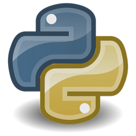

# The Ups and Downs of Migrating to Python 3: A Pragmatic Approach

Julian Berman  
[http://github.com/Julian](http://github.com/Julian)  
tos9 on Freenode (Come visit #python!)

# Presenter Notes

Only shameless plug - #python, best resource if you don't go into an office
Please hold off on guessing my opinion -- I'll try to make it known

A quick poll:

- Used Py3?
- Know your way around Py3
- Knew more about what Py3 contains?

Choose your own adventure

---

# Overview

What's **New**

What's *Touchy*

What's Coming

# Presenter Notes

Talking about Python3: It's a popular thing
Python: Around 25 years old
Python 3: Around 5 years old
3.0 had issues, so we're in year 3 of a 5 year estimation
Most vitriolic, polarized comments -- even reordering my slides
Part of the reason: it's here, in your face, now.
Python 2.6, 3.1: security fix only
Python 2.7, 3.2, 3.3: Bugfix

---

# Catching Up

`unittest` / `unittest2`

    !python
    self.assertRaises(IndexError, foo, [1, 2, 3], bar=12)

    with self.assertRaises(IndexError):
        [1, 2, 3][42]

    !python
    self.assertRaises(ValidationError, getattr, thing, "attr")

    with self.assertRaises(ValidationError):
        thing.attr

`argparse`

`str.format` enhancements

    !python
    "{} {} {}".format("hello", "world", "!")

`subprocess.check_output`

    !python
    >>> subprocess.check_output(["echo", "What a pretty kitty!"])
    'What a pretty kitty!'

# Presenter Notes
This is not a talk about 2.6->2.7 that is boring
Mentioning this only because it gives context: a lot is backported stuff
Porting tenet: Drop in new stuff **unittest2 & argparse backports**
In no way a comprehensive list, just a selection of stuff likely in daily use
Every version has a whatsnew page. Even tells you how to port.

---

# Catching Up

context manager propagation
  `zipfile.ZipFile`
  `bz2.BZ2File`
  ...

set literals and comprehensions

    !python
    >>> {i for i in xrange(10) if i % 2}
    set([1, 3, 5, 7, 9])

`dict` views

    !python
    >>> d = {1 : 2, 3 : 4}
    >>> d.viewkeys() & {1}
    set([1])

# Presenter Notes
Propagation: wild feature appears, then propagates
I have never seen anyone other than me use a dict view in Python 2 code.
Porting tenet: Stuff changed, but the standard library looked out for you
`doctest`: `IGNORE_EXCEPTION_DETAIL`

---

# Conception

Python 2 has "mistakes"

No we don't need a special function that does

    !python
    def input():
        eval(sys.stdin.readline())

# Presenter Notes
I couldn't resist the pun
Two general categories: what Python 3 fixes, byproduct: new features
Why don't new features get added to Python2: reduced maintenance burden
Mistakes: hard to fix without breaking backwards compat so no deprecation
The file() builtin's constructor

---

# Wat

    !js
    > 1 + "0"
    '10'

---

# Wat

    !python
    >>> 1 < "0"
    True

# Presenter Notes
Does anyone know how Python decides which are less than what?
(alphabetical by type name)
In some cases they're actual mistakes, in some cases they're due to evolution
Slightly more exciting: many builtins existed before iterators and generators
Smack people in the face like Haskell or other lazy languages with lazy
sequences so that you don't see so much of l = list(range())
implicit relative imports
These things make my life as a teacher easier but don't really affect my life
as a programmer. That's OK! And great. Easier for beginners.

---

# A million names to be cruel

`url...what?`

# Presenter Notes
configparser
cProfile
Queue

---

# Wat

    !python
    >>> d = {u"foo" : 12, b"bar" : "monkeys"}
    >>> d[b"foo"], d[u"bar"]
    (12, "monkeys")

---

# Wat

    !python
    >>> def add(s1, s2):
    ...     return " ".join(s1, s2)
    >>> print add(u"hello", "world")
    "hello world"
    >>> print add(u"hello", "w ⓞ rld")
    Traceback (most recent call last):
        ...
    UnicodeDecodeError: 'ascii' codec can't decode byte 0xe2 in position 3: ordinal not in range(128)

# Presenter Notes
**Main reason in reality though**: Python2 didn't always have unicode and
doesn't mix unicode and bytes well
Unexpectedly unicode or unexpectedly non-ascii, which essentially means
unexpectedly you didn't understand unicode :)
You call encode, you get a UnicodeDecodeError
http://bit.ly/unipain (Pragmatic Unicode)
unicode-nazi
If the story ended here it'd be great but it doesn't.

---

# Walk the Line

- Python 2 only

- Python 3 only

- Support everything or something in between

# Presenter Notes
I want to talk about options. To do so let's lay out our assumptions.
*Think about goals*
Yes people still write code just for Python 2. No it isn't COBOL.
New code? No deps or all satisfied? Go for it.
Non-commital way to put it: if you come to me with Python code, I don't assume
it's Py3. So if it's library code, you're stranding users.
You also may find it harder to find help.
If you're in the last category you're essentially committing to backporting
what you can (which as mentioned is not terribly difficult usually) or ignoring
things beyond 3.3 (which we'll talk about at the end) and you've also got to
worry about complexity
This may harder as time passes (which is intentional)

---

# So you want to write 2.x+3.x code

Figure out how!

- `2to3` (`python-modernize`)

- `3to2`

- unified codebase

# Presenter Notes
modernize: Ugh literals. PEP 414 u""

---

# So you want to write 2.x+3.x code

**Ignore** <2.6 and <(=)3.1

    !python
    try:
        int("Arg!")
    except ValueError, e:
        pass

# Presenter Notes
In the past you had to due to enterprisey OSes shipping old versions of Python
If you must: six
Have a test suite
Use tox

---

# So you want to write 2.x+3.x code

Be clever.

    !python
    from __future__ import unicode_literals, division

    if PY3:
        from urllib import parse as urlparse
        from urllib.parse import unquote
        from urllib.request import urlopen
        basestring = unicode = str
        iteritems = operator.methodcaller("items")
    else:
        from itertools import izip as zip
        from urllib import unquote
        from urllib2 import urlopen
        import urlparse
        iteritems = operator.methodcaller("iteritems")

# Presenter Notes
Top-heavy code: setting up the chessboard
Your goal in life is to avoid conditionals and have the same code do the right
thing
If you have to deal with and convert bytes and unicode you'll likely need
wrappers
It gets a little hairy since Python essentially flips "you write bytes to
files" on its head (codecs.open, io.open)
Backports
Disruption of consciousness: you work on a feature, realize you need a backport

---

# Lighten Up

# Presenter Notes
Immediate instinct for guy with flawed tool: *let me show you the way...*
You have people with noble intentions trying to move the language forward the
way they see fit (not core developers) and doing so by causing actual breakage.
This is where some real anymosity is bread: e.g. arch /usr/bin/python
Sublime Text 3
Tension
If you're a cynic you'd call it feature kidnapping
This isn't actually true: backports, lots by core developers
Answer sounds simple: keep a calm head, do what you can to provide tools to
help port, wait, *contribute to language development*, *use the language*.

---

# The Stragglers

- alternate implementations

- networking

- large frameworks

- backward compatible conscious

# Presenter Notes
Jython is still in 2.7 beta
Language moratorium really helped
PEP 399 - require pure Python implementations of stdlib modules
importlib was created in Python 3.3 for pure Python import system
This is not a talk about PyPy, but it would be ridiculous of me to be as
excited about Py3 as I am about PyPy (last 1 1/2 Pycons)
bytes.format no longer exists and the more strict separation between bytes and
unicode actually hurts here since people writing network code often are dealing
with some jammed together protocol with some stuff in some specified encoding
and some arbitrary bytes
wsgi needed to be updated in PEP 3333 to define what is what type. Web3.
wsgiref only appeared in 3.2
cgi module with lots of its parsing functions full of bugs
Async PEP + tulip
Lots of changes are mechanical and tedious. And no, don't just sed your
codebase.
Not every, numpy succeeded.
coverage + virtualenv support 2.4+
*Stuff that performs a task*: I use pelican but have no desire to help port it

---

# The Tragic Tale of twisted.internet.test.test_tcp

    !sh
    $ bin/trial twisted.test.test_tcp
    ...
    Ran 36 tests in 0.875s

    $ admin/run-python3-tests twisted.test.test_tcp
    ...
    Ran 36 tests in 38.698s

# Presenter Notes
Once Upon a Time... There was `buffer()`
Now there's memoryview but the behavior is ever so slightly different: can't
add bytes so can't share code. So every buffer test now copies on Py3.
Not a problem I think you'll have but it's *type* you may have

---

# zerozerozerozero

Python 2:

    !python
    >>> bytes(14)
    '14'

Python 3:

    !python
    >>> bytes(14)
    b'\x00\x00\x00\x00\x00\x00\x00\x00\x00\x00\x00\x00\x00\x00'

# Presenter Notes
When do you ever do this? @classmethod?

---

# contextlib.ExitStack

    !python
    def process(file=None):
        if file is None:
            file = open("a/default/file")
            cleanup_needed = True

        try:
            result = perform_operation()
            if result:
                cleanup_needed = False
        finally:
            if cleanup_needed:
                cleanup_resources()

# Presenter Notes
Written a context manager
Used anything in the contextlib module
Know what a context manager is

---

# contextlib.ExitStack

    !python
    from contextlib import ExitStack

    def process(file=None):
        with ExitStack() as stack:
            if file is None:
                file = open("a/default/file")
                stack.enter_context(file)
            process(file)

# Presenter Notes
It's kind of like groupby: in 3 years no one will use it but it will be useful

---

# Oh no! An exception!

    !python
    try:
        with open("document.txt") as f:
            content = f.read()
    except IOError as err:
        if err.errno == ENOENT:
            pass
        raise

# Presenter Notes
Exception chaining

---

# Optional Subparsers

    !sh
    $ git --version
    $ git commit -m "Hi!"
    $ git --color commit -m "Hi!"

# Presenter Notes
With any luck -- will land in 3.4

---

# Subtests

    !python
    class TestMultiplication(unittest.TestCase):
        def test_multiply(self):
            for i, j in itertools.product(range(2, 5), range(1, 3)):
                    with self.subTest(i=i, j=j):
                        self.assertEqual(multiply(i, j), i * j)

# Presenter Notes
Fail separately
Parametrized tests
py.test, testscenarios, everything under the sun have this

---

# Thanks
