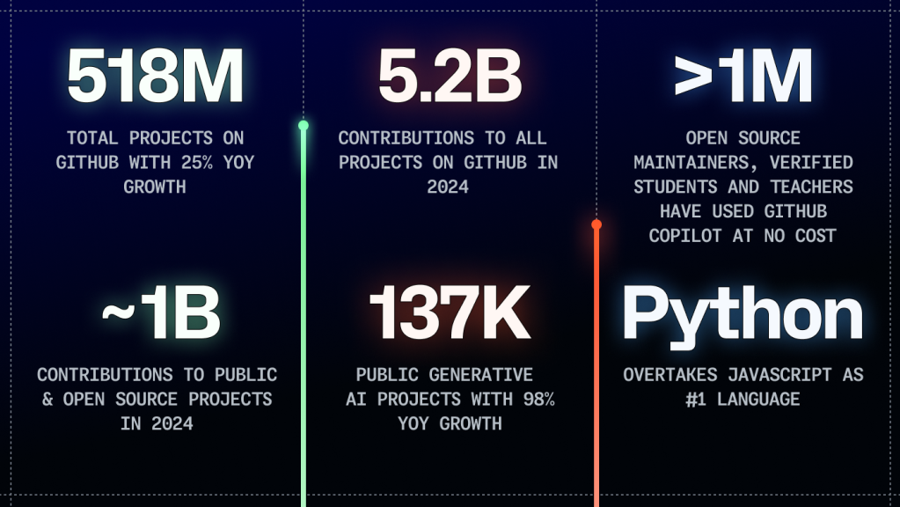

Hi.
===

<!-- column_layout: [3, 2] -->

<!-- column: 0 -->

<!-- new_lines: 3 -->


<!-- new_lines: 3 -->


`/in/julian-berman`

<!-- column: 1 -->

<!-- new_lines: 5 -->


<!-- new_lines: 2 -->

---

<!-- new_lines: 2 -->


<!-- end_slide -->

<!-- new_lines: 8 -->



<!-- new_lines: 2 -->

*GitHub Octoverse 2024*

(Hit 100M active users in 2023)

<!-- end_slide -->

<!-- jump_to_middle -->

`git` is a piece of software designed to help collaboratively work on an ongoing project, known as a **repository**.

<!-- pause -->
Often this repository is a piece of software, but it can really be anything.

<!-- pause -->

It helps you maintain *versions* of what you're working on, which it maintains forever, and helps groups of people from 1 to 2 to 10 to 100,000 concurrently work on the project with minimal friction.

<!-- pause -->

GitHub is a website which will host `git` repositories and which adds additional functionality to help with collaboration and discoverability.
It's sort of a social media for `git` repositories.

<!-- end_slide -->

<!-- jump_to_middle -->

# Why learn how to do this?

<!-- new_lines: 4 -->

* Something you use is developed on GitHub and you want to report a bug or help fix one

<!-- new_lines: 2 -->

<!-- pause -->

* You want to create something in public and may (or may not) hope to attract others with similar interests
<!-- new_lines: 2 -->

<!-- pause -->

* To take advantage of free computational resources (via GitHub Actions)

<!-- end_slide -->

<!-- jump_to_middle -->

Main goal
===

# Know how to:

* Send a *pull request* to a project on GitHub

<!-- pause -->

<!-- new_lines: 2 -->

* Decide whether to use `git` and GitHub for a collaborative project

<!-- end_slide -->

Overview
========

<!-- incremental_lists: true -->

<!-- column_layout: [1, 2, 4, 1] -->

<!-- column: 1 -->
<!-- jump_to_middle -->

- Using `git` via the GitHub interface
- Compare Working on someone else's project
- Using `git` from VSCode

<!-- pause -->

<!-- column: 2 -->
<!-- jump_to_middle -->

```
  easier to use
  less functionality
↑ further away from what's "really" happening
|
|→  GitHub.com interface
|
|→  GitHub Desktop
|
|→  Visual Studio Code's git support
|
|→  `git` command line
|
↓ more functionality
  less training wheels
  closer to what's "really" happening
```

<!-- end_slide -->

<!-- column_layout: [1, 6, 1] -->

<!-- column: 1 -->
<!-- jump_to_middle -->
https://github.com/education/students
=====================================

<!-- end_slide -->

<!-- column_layout: [1, 6, 1] -->

<!-- column: 1 -->
<!-- jump_to_middle -->
https://skills.github.com/
==========================

<!-- end_slide -->

<!-- column_layout: [1, 6, 1] -->

<!-- column: 1 -->
<!-- jump_to_middle -->
https://classroom.github.com/a/341n0yp6
=======================================

<!-- end_slide -->

<!-- column_layout: [1, 6, 1] -->

<!-- column: 1 -->
<!-- jump_to_middle -->
https://www.youtube.com/watch?v=2CjA-03yK8I
===========================================

<!-- end_slide -->

<!-- column_layout: [1, 6, 1] -->

<!-- column: 1 -->
<!-- jump_to_middle -->
`git` at the command line
===

<!-- end_slide -->

Further Reading
===

<!-- jump_to_middle -->

* [More GitHub Skills](https://skills.github.com/)
* [The `git` Book](https://git-scm.com/book/en/v2)


<!-- new_line -->

* [The Missing Semester](https://www.youtube.com/watch?v=2sjqTHE0zok&list=PLyzOVJj3bHQuloKGG59rS43e29ro7I57J)
* [Anthony Sottile](https://www.youtube.com/@anthonywritescode/search?query=git)

<!-- end_slide -->

How to Contribute
===

<!-- jump_to_middle -->

* https://github.com/szabgab/awesome-for-non-programmers
* https://github.com/MunGell/awesome-for-beginners/
* `some/project/you/already/use`
...

<!-- end_slide -->

<!-- jump_to_middle -->

Thanks!
===

<!-- column_layout: [1, 3, 1] -->
<!-- column: 1 -->

Questions?
