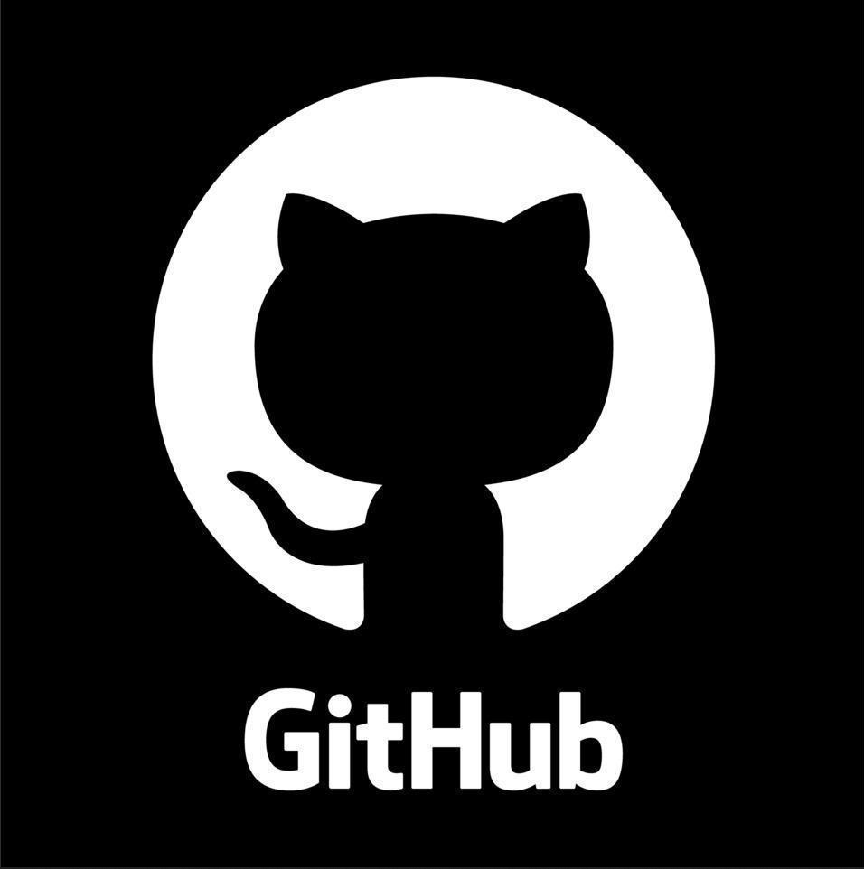
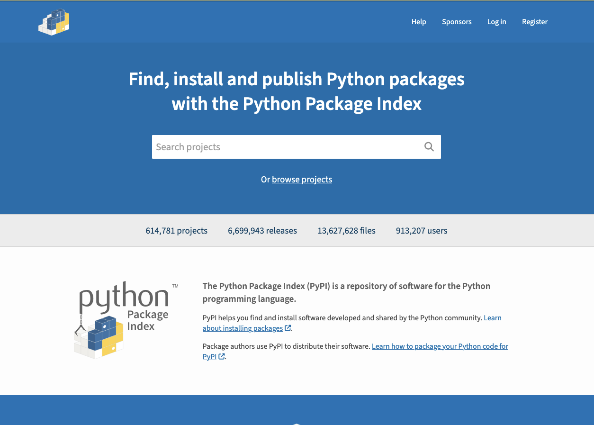

Hi.
===

<!-- column_layout: [3, 2] -->

<!-- column: 0 -->


<!-- new_lines: 3 -->



`/in/julian-berman`

<!-- column: 1 -->


<!-- new_lines: 1 -->

---

<!-- new_lines: 1 -->


<!-- end_slide -->

<!-- column_layout: [1, 2, 1, 2, 1] -->

<!-- pause -->
<!-- column: 1 -->
<!-- jump_to_middle -->
You downloaded some Python code and want to run it.

<!-- pause -->
<!-- column: 3 -->
<!-- jump_to_middle -->
You wrote some Python code and want to distribute it so others can run it.

<!-- end_slide -->


Overview
========

<!-- incremental_lists: true -->

<!-- column_layout: [2, 4, 2] -->

<!-- column: 1 -->
<!-- jump_to_middle -->

- What is packaging?
- What are dependencies?
- Managing dependencies with `uv`
- Publishing a package to PyPI

<!-- end_slide -->

Why Dependency Management and Packaging Matter
==============================================

<!-- column_layout: [1, 10, 1] -->

<!-- column: 1 -->
<!-- jump_to_middle -->

- Ensure someone can run code even if it needs other additional code available in order to run
<!-- new_line -->
- Make sure we have the right versions of code, because behavior might change between versions
<!-- new_line -->
- Make it simpler sharing your project with others
<!-- new_line -->

<!-- pause -->

Critical for both **using** and **publishing** Python projects.

<!-- end_slide -->

```python
import pygame
pygame.init()
pygame.mixer.music.load("cashregister.mp3")
pygame.mixer.music.play()
while pygame.mixer.music.get_busy(): 
    pygame.time.Clock().tick(60)
```

<!-- new_lines: 5 -->

```sh +exec
python play.py
```

<!-- end_slide -->

<!-- jump_to_middle -->

```sh +exec
uv run --with pygame play.py
```

<!-- end_slide -->

Three Types of Python Code
==========================

<!-- column_layout: [2, 2, 2] -->

<!-- column: 0 -->
<!-- jump_to_middle -->
# Built-ins

```python +exec
print(len([2, 4, 6]))
```

<!-- pause -->
<!-- column: 1 -->
<!-- jump_to_middle -->
# Standard Library

```python +exec
import math
/// print(
math.sqrt(2)
/// )
```

<!-- pause -->
<!-- column: 2 -->
<!-- jump_to_middle -->
# Third Party Libraries

```python
import numpy
import pandas
import pygame
...
```

<!-- end_slide -->

<!-- jump_to_middle -->

Dependencies
============

<!-- column_layout: [1, 20, 1] -->
<!-- column: 1 -->
*Code not included with Python which needs to be installed **separately** to use.*

<!-- pause -->

We use them because they **solve a problem**, once, and do so well.

And that means our own code doesn't have to reinvent the solution.

<!-- end_slide -->

<!-- jump_to_middle -->

<!-- column_layout: [1, 10, 1] -->
<!-- column: 1 -->

So how about — alongside Python code —

we also **declare** which dependencies are needed to run the code?

<!-- reset_layout -->

<!-- pause -->
This could be just written down in a `README`, but we can do better by **automating** it.

<!-- end_slide -->

Scripts, (Projects) & Packages
============================

<!-- new_lines: 2 -->
<!-- column_layout: [1, 5, 5, 1] -->

<!-- column: 1 -->
# Script

`mywork.py`

<!-- new_lines: 2 -->

one file with python code

often:
  - "one-off"
  - not distributed
  - has just one user

<!-- pause -->
<!-- new_line -->

Less common in the world...

but possibly more common in class!

<!-- pause -->

<!-- column: 2 -->
# Package

```
pandas/
├── frame.py
└── series.py
README.md
pyproject.toml
```

directory with lots of related Python code *and* some other stuff!

often:
  - distributed and reused
  - intended for more than one user

<!-- reset_layout -->

<!-- pause -->
<!-- column_layout: [1, 2, 1] -->

<!-- column: 1 -->
We'll talk about packages first.

<!-- end_slide -->

<!-- jump_to_middle -->

Maybe you've heard of...
===

* `pip`
* `venv`
* `virtualenv`
* `conda`
* `pip-tools`
* `pipenv`
* `poetry`
* ...

Forget what you know about them for now!

<!-- end_slide -->

<!-- jump_to_middle -->

Let's make a package
===

We could do everything I'm about to show you manually, or with other tools, but...

# [uv](https://docs.astral.sh/uv/)

`uv` is a fast and featureful tool for Python package management.


It was first released around a year ago (in 2024) but is already *extremely* popular with Python developers.

<!-- end_slide -->

<!-- jump_to_middle -->

```sh +exec
/// cd ~/Desktop
uv init --package pdldemo
```

<!-- end_slide -->

What did we get?
===

<!-- column_layout: [1, 1] -->

<!-- column: 0 -->
```sh +exec
tree ~/Desktop/pdldemo
```

<!-- pause -->

<!-- column: 1 -->
## And it's a git repository.

```sh +exec
/// cd ~/Desktop/pdldemo
git status
```

<!-- end_slide -->

Adding Dependencies
===

```sh +exec
/// cd ~/Desktop/pdldemo
uv add pandas
```

<!-- end_slide -->

Transitive Dependencies
===

<!-- new_lines: 5 -->

<!-- column_layout: [1, 10, 1] -->
<!-- column: 1 -->


We added 1 package but got 7. Why?

```sh +exec
/// cd ~/Desktop/pdldemo
uv tree
```

<!-- pause -->

Dependencies have their own dependencies!

<!-- end_slide -->

Virtual Environments (& Why You May Not Care)
===

<!-- column_layout: [5, 5] -->

<!-- column: 0 -->

```sh +exec
/// cd ~/Desktop/pdldemo/
ls .venv/bin
#  ↑ Our isolated
#     environment
```

<!-- pause -->

<!-- column: 1 -->

- Each project gets a new Python environment
- Packages installed in one don't affect another
- Solves "dependency hell" and version conflicts
- ...and `uv` creates and manages this automatically

<!-- pause -->

---

## Traditional workflow
### (`pip` + `venv`)

```sh
python -m venv .venv
source .venv/bin/activate
pip install -r requirements.txt
```

- Separate tools for different tasks
- Manual dependency file management
- Still works, just more steps

<!-- end_slide -->

<!-- jump_to_middle -->

Using Our Dependency
===

```sh +exec +acquire_terminal
/// cd ~/Desktop/pdldemo
uv run python
```

<!-- pause -->

or by adding code which depends on `pandas` to our package.

<!-- end_slide -->

Dependency Versions
===

<!-- column_layout: [1, 5, 5, 1] -->
<!-- column: 1 -->

## Depend on...

```python
# pandas
pandas

# pandas 2.0 or newer
pandas>=2.0.0

# exactly pandas 2.0.3
pandas==2.0.3
```

<!-- pause -->

The more specific we are, the more likely that someone who uses our package gets an environment just like ours, and thereby one that works for them.

<!-- pause -->
...but the more specific we are, the more likely that some other package installed next to ours might have a *different* exact set of versions it wants!

<!-- pause -->
<!-- column: 2 -->

### `pyproject.toml`

Declares our dependencies with flexible ranges.

<!-- pause -->

### `uv.lock`

A file `uv` creates and manages which always has a big list of *exact* working versions.

<!-- pause -->

### `requirements.txt` (and `.in`)

A traditional format first invented by `pip` which can contain similar information.

<!-- end_slide -->

VSCode & `venv` & `uv`
===

<!-- jump_to_middle -->


<!-- column_layout: [1, 10, 1] -->
<!-- column: 1 -->

- VSCode's Python extension automatically detects `.venv` in a Python project
- You can verify or select the Python interpreter in the bottom right corner

VSCode should:
- Use your dependencies for IntelliSense
- Run code with the correct packages

<!-- end_slide -->

<!-- jump_to_middle -->

Publishing a Package
===

<!-- end_slide -->

<!-- jump_to_middle -->

<!-- column_layout: [1, 10, 1] -->
<!-- column: 1 -->

- to share your work with others
- because it solves a problem
- because it's fun to tinker
- to build your resumé
- to make money $$$
- ...

<!-- end_slide -->

The Python Package Index (PyPI)
===

<!-- new_lines: 3 -->

<!-- column_layout: [1, 5, 5, 1] -->
<!-- column: 1 -->

PyPI is where Python packages live:
- https://pypi.org
- Over 450,000 projects
- Community-maintained resource
- Where `uv add` and `pip install` download from

<!-- column: 2 -->



<!-- reset_layout -->

<!-- pause -->
<!-- new_lines: 2 -->

[TestPyPI](https://test.pypi.org) is a sandbox usable for learning how to interact with it.

<!-- end_slide -->

But First...
===

<!-- jump_to_middle -->

<!-- column_layout: [1, 10, 1] -->
<!-- column: 1 -->

<!-- incremental_lists: true -->

Before publishing, consider:

- a license, which tells people they're allowed to use what you publish!
  This goes in your `pyproject.toml`.

<!-- new_line -->

- some form on documentation.
  At least a `README`, but it's common to publish on [ReadTheDocs](https://rtfd.io)

<!-- end_slide -->

Let's Publish!
===

<!-- new_lines: 3 -->

<!-- column_layout: [1, 5, 5, 1] -->
<!-- column: 1 -->

# Build our package:

```sh +exec
/// cd ~/Desktop/pdldemo
uv build
```

<!-- pause -->
<!-- column: 2 -->

# Upload (to TestPyPI):

```sh +exec
/// cd ~/Desktop/pdldemo
/// printf >>pyproject.toml '
/// [[tool.uv.index]]
/// name = "testpypi"
/// url = "https://test.pypi.org/simple/"
/// publish-url = "https://test.pypi.org/legacy/"
/// '
uv publish --index testpypi
```

<!-- end_slide -->

`uv` Cheatsheet
===

<!-- column_layout: [1, 5, 5, 1] -->
<!-- column: 1 -->

## Creating a Project
```sh
uv init --package projectname
```

## Run code

```sh
uv run script.py
uv run python
```

## Viewing what's installed

```sh
uv tree
```

<!-- column: 2 -->

## Adding dependencies

```sh
uv add fuzzywuzzy
```

## Building a Project

```sh
uv build
```

## Publishing to PyPI

```sh
uv publish
```

<!-- end_slide -->

Further Reading
===

<!-- jump_to_middle -->

* [`uv` documentation](https://docs.astral.sh/uv/)
* [Python Packaging Guide](https://packaging.python.org/en/latest/)

And some friends...

* [Hynek](https://www.youtube.com/@The_Hynek)
* [Anthony Sottile](https://www.youtube.com/@CodeWithAnthony)

<!-- end_slide -->

<!-- jump_to_middle -->

Thanks!
===

<!-- column_layout: [1, 3, 1] -->
<!-- column: 1 -->

Questions?
