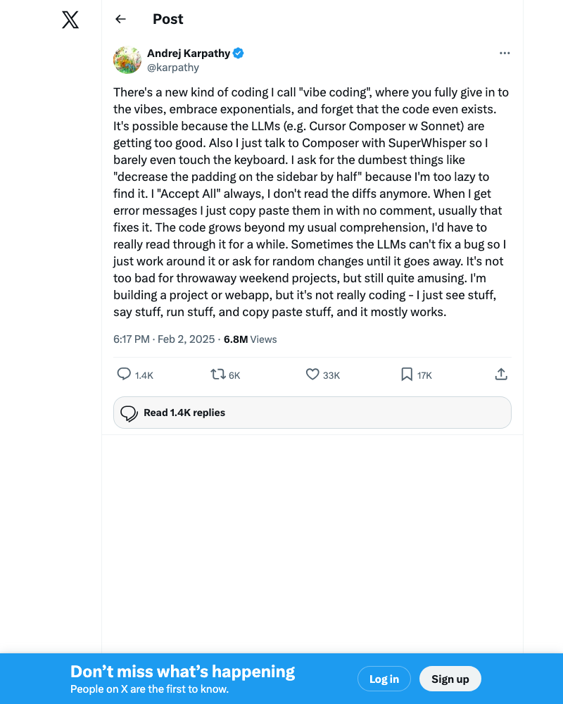
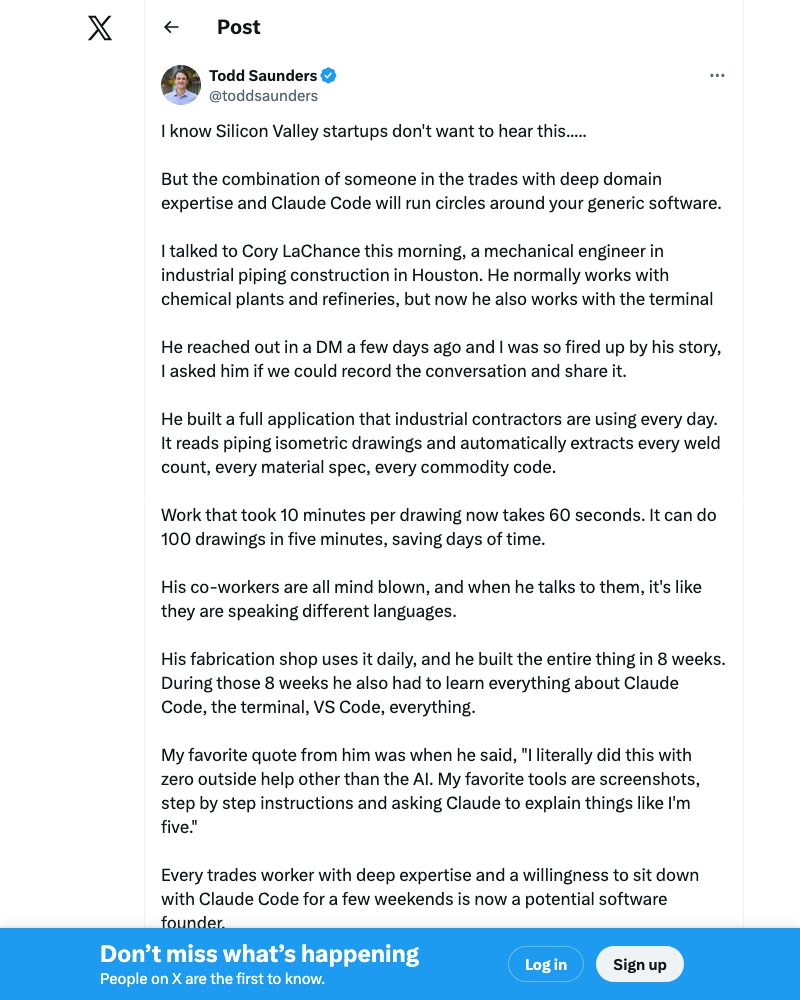
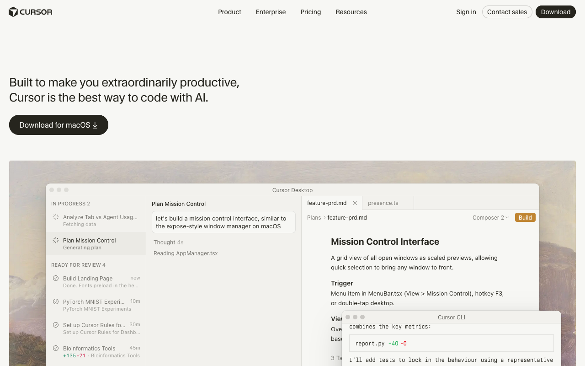
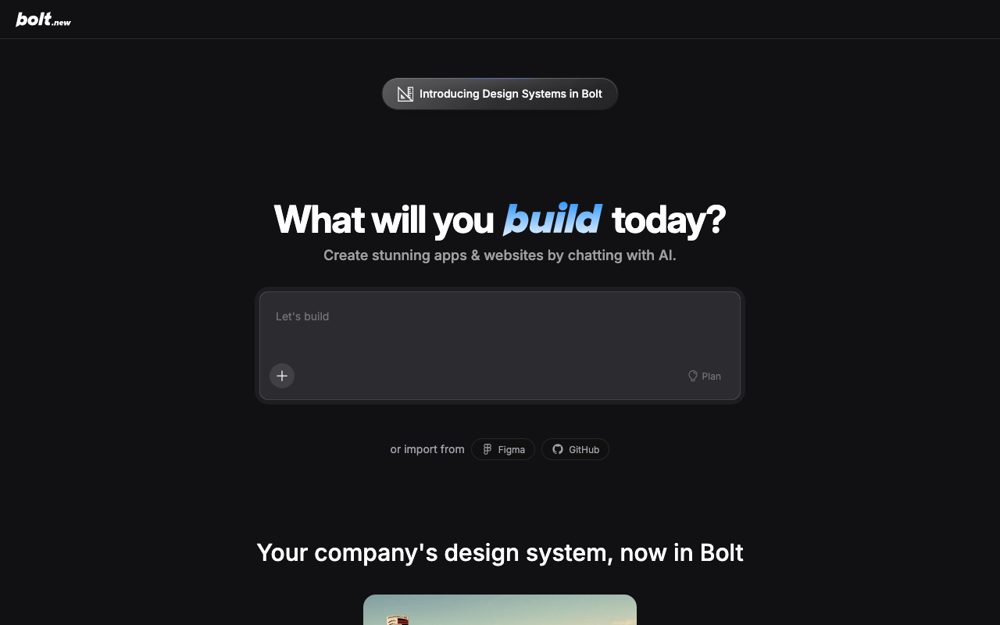
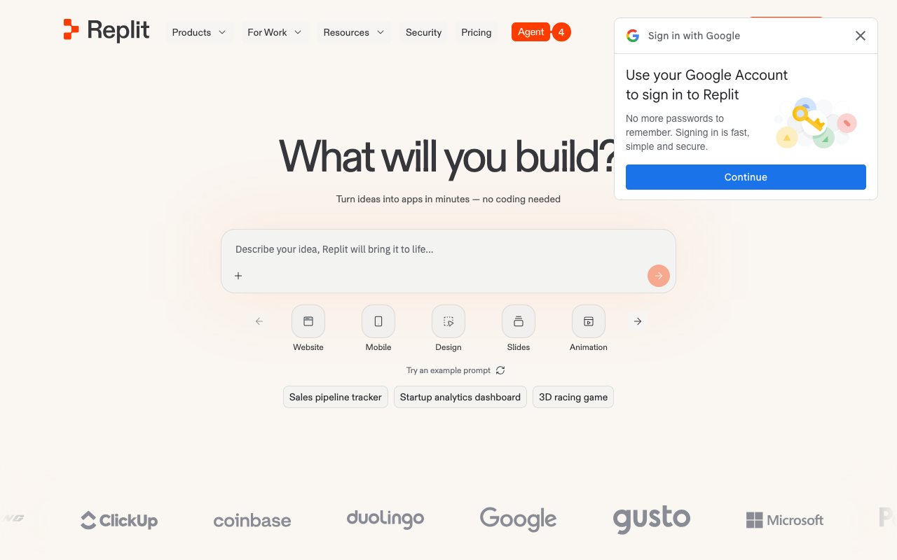
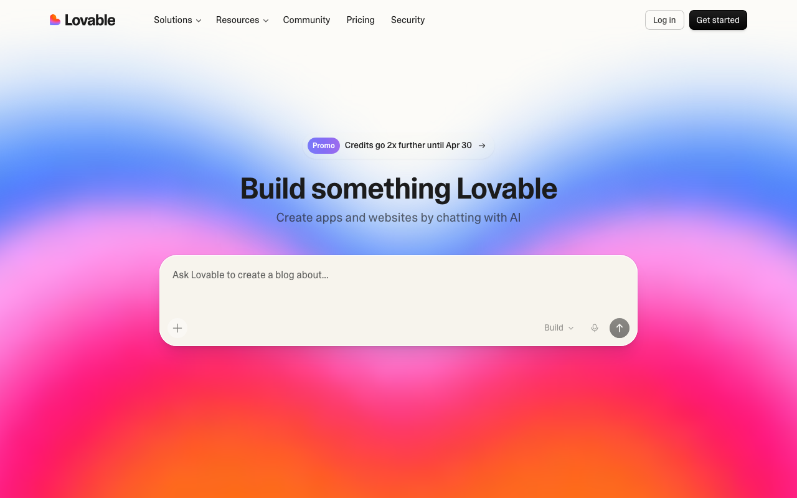
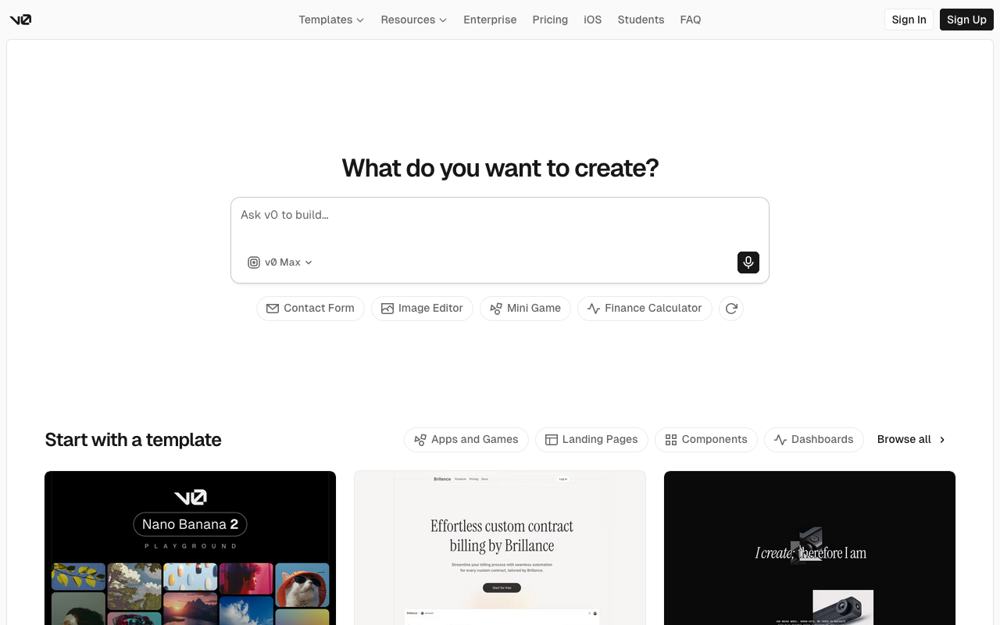

Hi.
===

<!-- column_layout: [3, 2] -->

<!-- column: 0 -->


<!-- new_lines: 3 -->


`/in/julian-berman`

<!-- column: 1 -->


<!-- new_lines: 1 -->

---

<!-- new_lines: 1 -->


<!-- end_slide -->

What is "Vibe Coding"?
======================



<!-- end_slide -->

What is "Vibe Coding"?
======================

<!-- jump_to_middle -->

<!-- column_layout: [1, 4, 1] -->

<!-- column: 1 -->

```sh +exec +acquire_terminal
open "https://en.wikipedia.org/wiki/Vibe_coding"
```

<!-- end_slide -->

Why does this matter for you?
=============================

<!-- jump_to_middle -->

<!-- column_layout: [1, 4, 1] -->

<!-- column: 1 -->

<!-- incremental_lists: true -->

* You don't need to be a software engineer to build software anymore

* The barrier went from "years of training" to "describe what you want"

* Your domain expertise *is* the valuable skill

<!-- end_slide -->

Why does this matter for you?
=============================



<!-- end_slide -->

The Spectrum of Tools
=====================

<!-- jump_to_middle -->

<!-- column_layout: [1, 6, 1] -->

<!-- column: 1 -->

Not all AI coding tools are the same.

<!-- pause -->

They range from *helping you type* to *building the whole thing for you*.

<!-- end_slide -->

Autocomplete
============

<!-- column_layout: [1, 4, 1] -->

<!-- column: 1 -->

<!-- jump_to_middle -->

Predicts what you'll type next, like your phone keyboard but for code.

<!-- new_lines: 1 -->

* [GitHub Copilot](https://github.com/features/copilot)
* [TabNine](https://www.tabnine.com/)

<!-- new_lines: 1 -->

You still write the code — it just finishes your sentences.

<!-- end_slide -->

AI-Assisted IDEs
================

<!-- column_layout: [1, 2, 1, 2, 1] -->

<!-- column: 1 -->
<!-- jump_to_middle -->

A code editor with an AI chat built in.

You ask it questions, it suggests changes, you accept or reject.

<!-- column: 3 -->
<!-- jump_to_middle -->



<!-- new_lines: 1 -->

* [Cursor](https://cursor.com)
* [Windsurf](https://windsurf.com)

<!-- end_slide -->

Web App Builders
================

<!-- column_layout: [3, 1, 3] -->

<!-- column: 0 -->

<!-- jump_to_middle -->

Describe what you want, get a running app — in your browser, no setup.

<!-- new_lines: 1 -->

**This is probably the easiest place to start.**

<!-- column: 2 -->



<!-- pause -->



<!-- end_slide -->

Web App Builders
================

<!-- column_layout: [3, 1, 3] -->

<!-- column: 0 -->

<!-- jump_to_middle -->



<!-- column: 2 -->

<!-- jump_to_middle -->



<!-- end_slide -->

Web App Builders
================

<!-- jump_to_middle -->

<!-- column_layout: [1, 6, 1] -->

<!-- column: 1 -->

<!-- incremental_lists: true -->

* [**Bolt**](https://bolt.new) — bolt.new
* [**Lovable**](https://lovable.dev) — lovable.dev
* [**Replit**](https://replit.com) — replit.com
* [**v0**](https://v0.app) — v0.app (by Vercel)

<!-- new_lines: 1 -->

All have free tiers. Open a browser, describe your app, go.

<!-- end_slide -->

Coding Agents
=============

<!-- column_layout: [1, 4, 1] -->

<!-- column: 1 -->

<!-- jump_to_middle -->

You describe what you want. The agent writes code, runs it, fixes errors, and iterates — on your computer.

<!-- new_lines: 1 -->

<!-- incremental_lists: true -->

* [**Claude Code**](https://docs.anthropic.com/en/docs/claude-code) — what I use
* [**OpenCode**](https://opencode.ai) — open source, works with free models
* [**Codex**](https://openai.com/index/codex/) (OpenAI)
* [**pi**](https://github.com/badlogic/pi-mono/tree/main/packages/coding-agent) — open source, multi-provider

<!-- new_lines: 1 -->

<!-- pause -->

More power, but requires some comfort with the terminal.

(It's also possible to run models entirely on your own hardware.)

<!-- end_slide -->

Multi-Agent / Autonomous
========================

<!-- jump_to_middle -->

<!-- column_layout: [1, 4, 1] -->

<!-- column: 1 -->

Multiple AI agents collaborating on a task — planning, coding, reviewing.

<!-- new_lines: 1 -->

* [Devin](https://devin.ai)
* [Gas Town](https://github.com/gastownhall/gastown) — orchestrates 20+ agents in parallel
* [OpenHands](https://github.com/All-Hands-AI/OpenHands)

<!-- new_lines: 1 -->

The frontier — coordinating teams of AI agents on a single codebase.

<!-- end_slide -->

Vibe Coding vs. Agentic Engineering
====================================

<!-- jump_to_middle -->

<!-- column_layout: [1, 2, 1, 2, 1] -->

<!-- column: 1 -->

### Vibe Coding

The AI writes code, you don't look too closely.

Great for prototypes, personal projects, exploring ideas.

<!-- column: 3 -->

### Agentic Engineering

The AI writes code, you review every change.

What professionals do for production software.

<!-- end_slide -->

Vibe Coding vs. Agentic Engineering
====================================

<!-- jump_to_middle -->

<!-- column_layout: [1, 4, 1] -->

<!-- column: 1 -->

```sh +exec +acquire_terminal
open "https://simonwillison.net/guides/agentic-engineering-patterns/what-is-agentic-engineering/"
```

<!-- end_slide -->

Writing Good Specifications
============================

<!-- jump_to_middle -->

<!-- column_layout: [1, 5, 1] -->

<!-- column: 1 -->

If there's one skill that replaces "learning to code," it's this:

<!-- new_lines: 1 -->

**Learning to describe what you want clearly.**

<!-- end_slide -->

It's a Conversation
====================

<!-- jump_to_middle -->

<!-- column_layout: [1, 5, 1] -->

<!-- column: 1 -->

<!-- incremental_lists: true -->

* You don't need to get it right on the first try

* The AI is a **brainstorming partner** — use it to refine your idea

* "Here's my rough idea... what am I missing?"

* "What would a user expect to happen when...?"

* "Is this specification clear enough to build from?"

<!-- end_slide -->

Bad vs. Good
=============

<!-- column_layout: [1, 3, 1, 3, 1] -->

<!-- column: 1 -->
<!-- jump_to_middle -->

### Bad

"Make me a cooking website"

<!-- column: 3 -->
<!-- jump_to_middle -->

<!-- pause -->

### Good

"A recipe organizer where I can:

- paste a URL and it extracts the recipe title, ingredients, and steps
- search my saved recipes by ingredient
- check off ingredients as I shop"

<!-- end_slide -->

Practical Tips
==============

<!-- jump_to_middle -->

<!-- column_layout: [1, 5, 1] -->

<!-- column: 1 -->

<!-- incremental_lists: true -->

* Nothing replaces expertise! If you know something is wrong, say it!

* **Say what it should do**, not how to build it

* **Give examples** — "when I type 'chicken', it shows all recipes with chicken"

* **Start small**, then add features — don't specify everything at once

* **Ask the AI to review your spec** — "What's missing?"

* **Ask the AI to check its work** — "Is this secure? What happens if a user does X?"

* Security!

<!-- end_slide -->

What to Watch Out For
=====================

<!-- jump_to_middle -->

<!-- column_layout: [1, 5, 1] -->

<!-- column: 1 -->

<!-- incremental_lists: true -->

* It will confidently produce broken things — **always try running it**

* Don't paste sensitive or personal data into free tools

* It's better at common patterns than novel ones

* You still need to *read* what it produces, even if you didn't write it

* Layering more AI on top doesn't eliminate blind spots

<!-- end_slide -->

<!-- jump_to_middle -->

Let's build something.
===

<!-- end_slide -->

Demo
====

<!-- jump_to_middle -->

<!-- column_layout: [1, 2, 1, 2, 1] -->

<!-- column: 1 -->

### Coding Agent

Building an app with **Claude Code** in the terminal.

<!-- column: 3 -->

### Web App Builder

Building the same app with a **web-based builder** — no setup.

<!-- end_slide -->

Your Turn!
==========

<!-- jump_to_middle -->

<!-- column_layout: [1, 5, 1] -->

<!-- column: 1 -->

**Open one of these in your browser and build something:**

* bolt.new
* lovable.dev
* replit.com
* v0.app

<!-- new_lines: 1 -->

<!-- pause -->

Some ideas:

<!-- incremental_lists: true -->

* A recipe organizer with ingredient search
* A campus event map
* A personal portfolio site
* A study group finder
* A budget tracker
* ... or whatever you've always wished existed

<!-- pause -->

<!-- new_lines: 1 -->

Instructions: *(GitHub Classroom link here)*

<!-- end_slide -->

Further Reading
===

<!-- jump_to_middle -->

* [Andrej Karpathy — "Vibe Coding"](https://x.com/karpathy/status/1886192184808149383)
* [Simon Willison — Agentic Engineering Patterns](https://simonwillison.net/guides/agentic-engineering-patterns/what-is-agentic-engineering/)
* [bolt.new](https://bolt.new) / [lovable.dev](https://lovable.dev) / [replit.com](https://replit.com) / [v0.app](https://v0.app)
* [Claude Code](https://docs.anthropic.com/en/docs/claude-code)
* [OpenCode](https://opencode.ai)

<!-- end_slide -->

<!-- jump_to_middle -->

Thanks!
===

<!-- column_layout: [1, 3, 1] -->
<!-- column: 1 -->

Questions?
